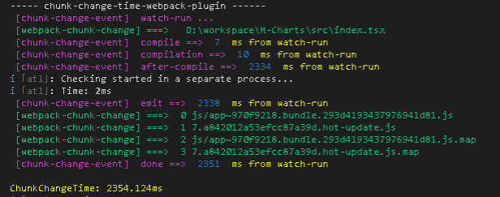

# Chunk Change Time Webpack Plugin

A Webpack plugin to record chunk chang time

<a href="https://www.npmjs.com/chunk-change-time-webpack-plugin" target="_blank"></a>
<a href="https://www.npmjs.com/chunk-change-time-webpack-plugin" target="_blank"></a>
<a href="https://www.npmjs.com/chunk-change-time-webpack-plugin" target="_blank"></a>

### install

```javascript

npm i chunk-change-time-webpack-plugin

```

### use

```javascript

new chunkChangeWebpackPlugin({
    name:'chunk-change-time-webpack-plugin' // custom name 
})

```
### result


